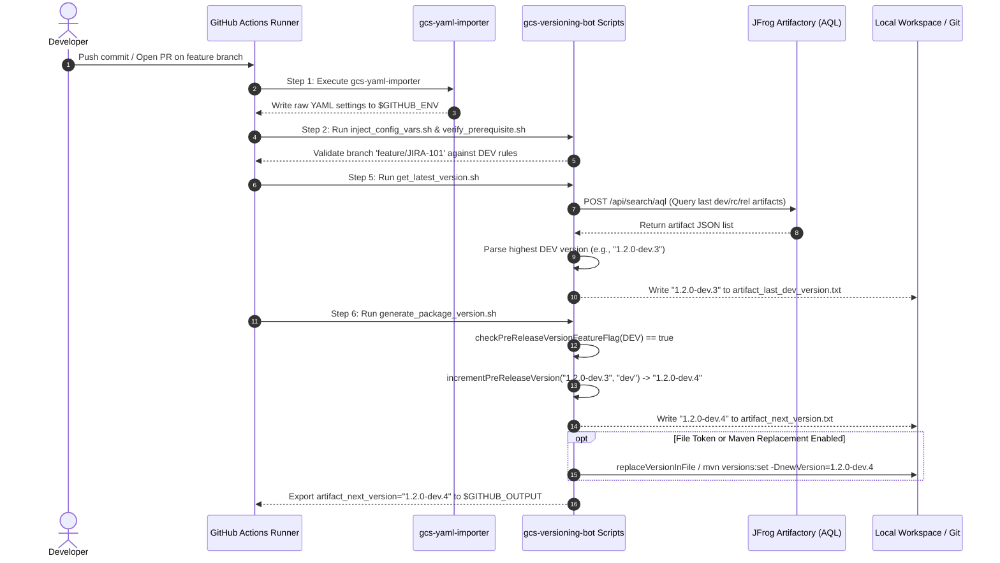
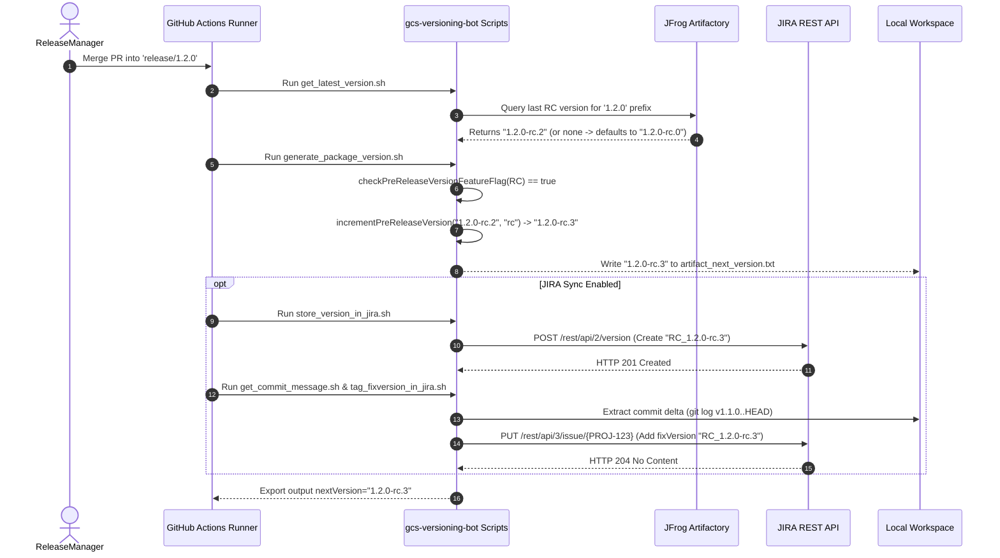
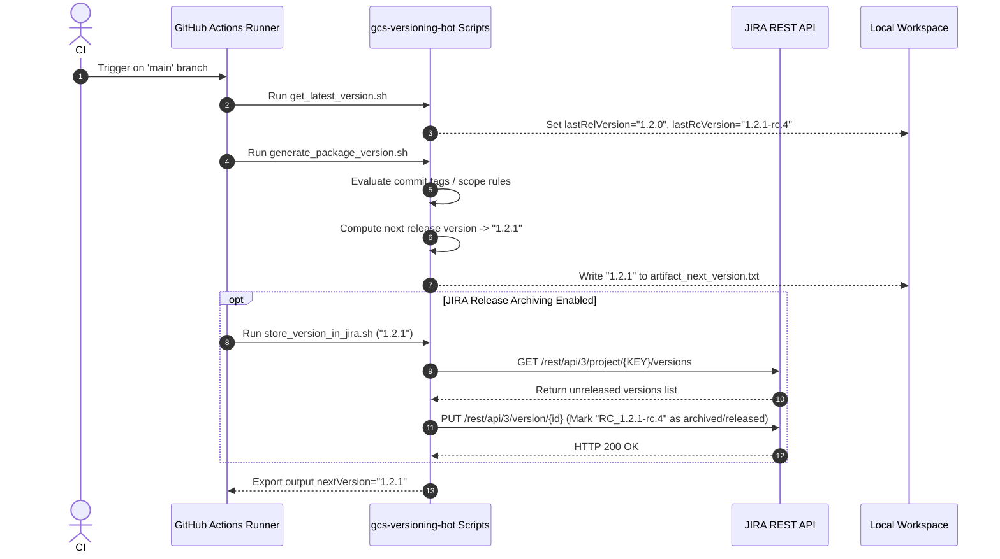

# 02 - Architecture & Pipeline Execution Flow

## 1. System Topology & Subsystem Boundaries

The `gcs-versioning-bot` system comprises six core functional subsystems operating inside a GitHub Actions runner environment:

```
+---------------------------------------------------------------------------------------------------+
|                                     GITHUB ACTIONS RUNNER                                         |
|                                                                                                   |
|  +---------------------------+       +---------------------------+       +---------------------+  |
|  |  1. CONFIGURATION IMPORT   | ----> |   2. SCOPE INJECTION      | ----> |  3. PREREQUISITE    |  |
|  |  - gcs-yaml-importer      |       |   - inject_config_vars.sh |       |     VALIDATION      |  |
|  |  - controller YAML        |       |   - config/general.ini    |       |  - verify_prereq.sh |  |
|  +---------------------------+       +---------------------------+       +---------------------+  |
|                                                                                    |              |
|                                                                                    v              |
|  +---------------------------+       +---------------------------+       +---------------------+  |
|  |  6. EXTERNAL SYNCH       | <---- |   5. FILE REPLACEMENT     | <---- |  4. VERSION STATE   |  |
|  |  - store_version_in_jira  |       |      & EXPORT ENGINE      |       |     CALCULATION     |  |
|  |  - tag_fixversion_in_jira |       |   - replaceVersionInFile  |       |  - get_latest_ver   |  |
|  |  - $GITHUB_OUTPUT / _ENV  |       |   - replaceVersionForMaven|       |  - generate_pkg_ver |  |
|  +---------------------------+       +---------------------------+       +---------------------+  |
+---------------------------------------------------------------------------------------------------+
```

---

## 2. End-to-End Pipeline Step Execution Sequence

When a workflow step invokes `partior-libs/gcs-versioning-bot`, `action.yml` orchestrates execution across nine sequential steps:

| Step # | Action Step Name | Script / Command Executed | Primary Purpose | Inputs / State Used | Outputs / Artifacts Generated |
| :---: | :--- | :--- | :--- | :--- | :--- |
| **1** | Import Controller Yaml Config | `partior-libs/gcs-yaml-importer` | Reads project controller YAML file and merges default configurations. | `controller-config-file-path`, `config-default-query-path` | Populates `$GITHUB_ENV` with raw YAML keys. |
| **2** | Inject Config Variables | `scripts/inject_config_vars.sh` | Converts raw YAML keys to standardized shell environment scope variables. | `$GITHUB_ENV`, `config/general.ini` | Exports `MAJOR_*`, `MINOR_*`, `PATCH_*`, `RC_*`, `DEV_*` variables. |
| **3** | List Config Variables (Debug) | `scripts/list_config_variables.sh` | Prints active scope flags and variables when `is-debug: 'true'`. | Environment scope variables | Debug log streams (`stdout`/`stderr`). |
| **4** | Verify Prerequisite | `scripts/verify_prerequisite.sh` | Validates that current branch or tag is permitted by active scope rules. | `BUILD_GH_BRANCH_NAME`, `BUILD_GH_TAG_NAME` | Exits with error (1) if branch is disallowed. |
| **5** | Retrieve Latest Version | `scripts/get_latest_version.sh` | Queries Artifactory, JIRA, or Docker API for historic versions. | Artifactory creds, JIRA creds, repo names | `artifact_last_dev_version.txt`, `artifact_last_rc_version.txt`, `artifact_last_rel_version.txt`, `artifact_last_base_version.txt` |
| **6** | Generate Package Version | `scripts/generate_package_version.sh` | Core decision engine. Calculates next semantic version and applies file replacements. | Last version files, commit message tags, file tokens | `artifact_next_version.txt`, updated `pom.xml`/source files. |
| **7** | Sync Version in JIRA | `scripts/store_version_in_jira.sh` | Creates the new version entry in JIRA and archives superseded versions. | JIRA URL/creds, `artifact_next_version.txt` | New JIRA Version object created in JIRA project. |
| **8** | Extract Delta Commit Msg | `scripts/get_commit_message.sh` | Extracts git commit history between last release tag and `HEAD`. | `git log`, `artifact_last_rel_version.txt` | `commit-message-tmp` file. |
| **9** | Tag FixVersion in JIRA | `scripts/tag_fixversion_in_jira.sh` | Scans commit messages for ticket keys (`PROJ-123`) and tags them with fixVersion. | `commit-message-tmp`, JIRA creds | JIRA issue fields updated with `fixVersions`. |

---

## 3. Detailed Mermaid Sequence Diagrams

### 3.1 Pull Request / Feature Branch Flow (`DEV` Versioning)

In a typical developer workflow, a Pull Request is opened or updated on a feature branch. The bot calculates a `-dev.N` version and updates project manifests.



---

### 3.2 Release Branch Flow (`RC` Versioning & JIRA Version Creation)

When code merges into a release staging branch (`release/1.2.0` or `rc`), the bot calculates a `-rc.N` version, updates JIRA, and tags issues.



---

### 3.3 Main Branch Merge & Fixed Release Flow (`X.Y.Z` Release)

When code is tagged or merged into `main`/`master`, a full production release version (`X.Y.Z`) is generated, archiving prior pre-releases in JIRA.



---

## 4. Inter-Script Communication & State File Directory

Because each step in `action.yml` runs as a distinct bash process execution, state is communicated across scripts via standardized workspace temporary files.

| File Path | Creator Script | Consumer Script(s) | Contents / Format |
| :--- | :--- | :--- | :--- |
| `yaml-importer-tmp` | `gcs-yaml-importer` | `inject_config_vars.sh` | Shell export lines (`export key=value`). |
| `artifact_last_dev_version.txt` | `get_latest_version.sh` | `generate_package_version.sh`, `read_old_version.sh` | Single SemVer string (e.g. `1.2.0-dev.3`). |
| `artifact_last_rc_version.txt` | `get_latest_version.sh` | `generate_package_version.sh`, `read_old_version.sh` | Single SemVer string (e.g. `1.2.0-rc.1`). |
| `artifact_last_rel_version.txt` | `get_latest_version.sh` | `generate_package_version.sh`, `read_old_version.sh` | Single SemVer string (e.g. `1.2.0`). |
| `artifact_last_base_version.txt` | `get_latest_version.sh` | `generate_package_version.sh` | Single SemVer string (e.g. `1.2.0-hf.1`). |
| `artifact_updated_rel_version.txt`| `generate_package_version.sh`| `generate_package_version.sh` | Base `X.Y.Z` release version after file/scope overrides. |
| `artifact_next_version.txt` | `generate_package_version.sh`| `read_new_version.sh`, `store_version_in_jira.sh`, `action.yml` | Final calculated version string (e.g. `1.2.1`). |
| `is_initial.flag` | `get_latest_version.sh` | `generate_package_version.sh` | `true` if no previous artifacts were found in registry. |
| `core.updated` | `generate_package_version.sh`| `generate_package_version.sh` | Temporary touch file indicating core version was incremented. |
| `commit-message-tmp` | `get_commit_message.sh` | `tag_fixversion_in_jira.sh` | Raw git commit log text delta between last tag and `HEAD`. |
